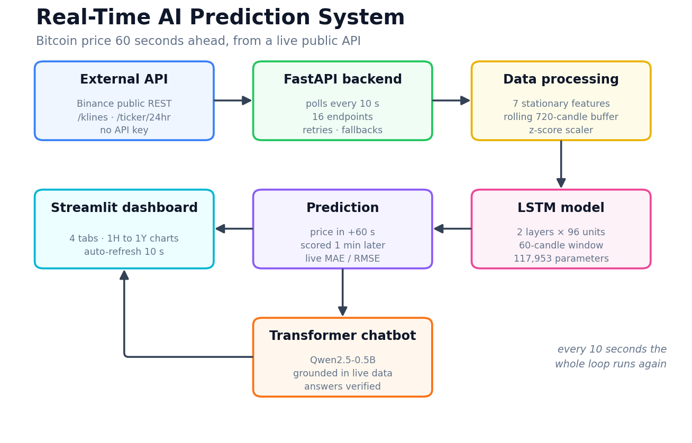
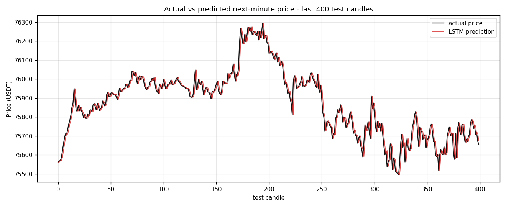
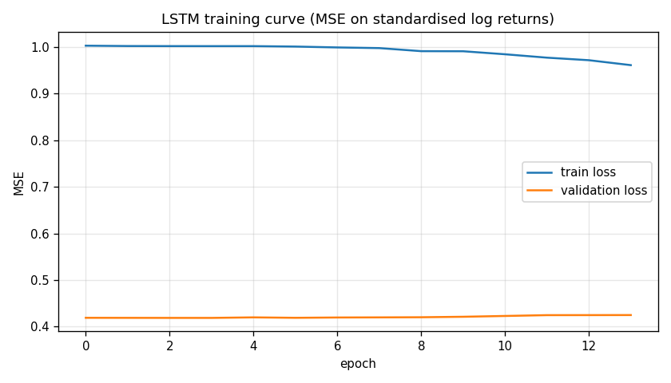
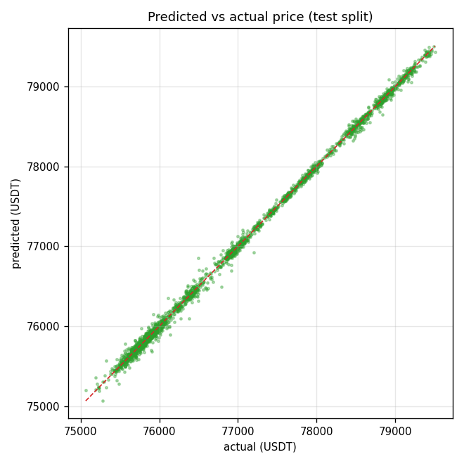
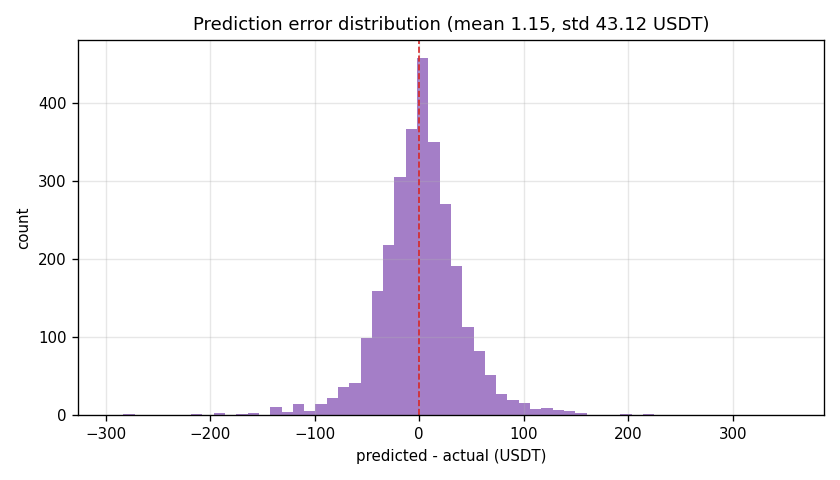
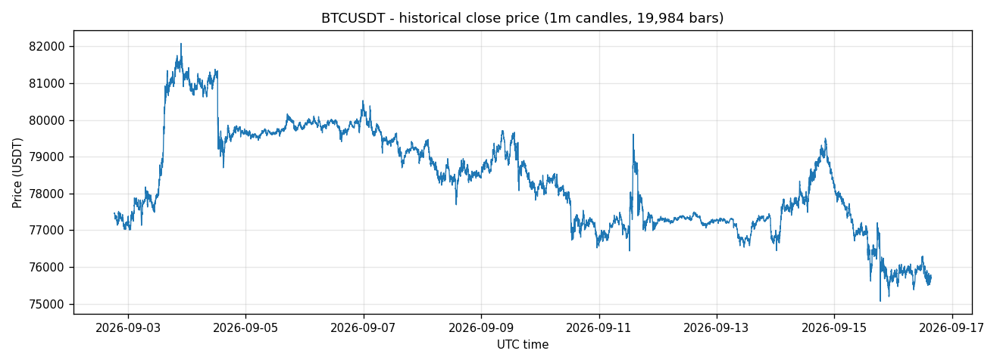

# Real-Time AI Prediction System

**Predicting the Bitcoin price 60 seconds into the future, from live market data, every 10 seconds.**

An end-to-end system: it pulls real data from a public API, engineers features, runs an LSTM,
scores its own forecast one minute later, and lets you ask a Transformer chatbot about any of it
from a Streamlit dashboard.



---

## The 60-second version

| Question | Answer |
|---|---|
| **What is the problem?** | Predict where the Bitcoin price will be in 60 seconds, continuously, from live market data. |
| **What is the data?** | 20,000 real 1-minute BTC/USDT candles from the **Binance public REST API**. No API key. Live data arrives every 10 seconds. |
| **What does the model predict?** | Given the **last 60 candles**, it predicts the **log return of the next candle**, converted back to a price: `price × exp(return)`. Horizon: **60 seconds**. |
| **How does it work?** | `Binance API → FastAPI (polls every 10s) → features → LSTM → prediction → Streamlit + chatbot` |
| **What are the results?** | On a held-out test split: **MAE $29.65**, **RMSE $43.14**, **MAPE 0.0386%**, **R² 0.9986**. It ties a naive baseline on direction, and [the README says so honestly](#8-honest-limitations). |
| **How do I run it?** | `pip install -r requirements.txt` → `python run.py` |

---

## Results

Measured on the most recent 15% of the data, which the model never saw during training
(2,939 sequences, evaluated in real US-dollar price space).

| Metric | Test | Validation | Naive baseline (test) |
|---|---|---|---|
| **MAE** | **$29.65** | $14.56 | $29.65 |
| **MSE** | 1,861.04 | 568.99 | 1,860.36 |
| **RMSE** | **$43.14** | $23.85 | $43.13 |
| **MAPE** | **0.0386 %** | 0.0188 % | 0.0386 % |
| **R²** | **0.9986** | 0.9948 | 0.9986 |
| Directional accuracy | 49.81 % | 45.63 % | — |

On a price near $76,000 an average miss of $29.65 is about four hundredths of one percent.
The naive baseline column is the "price will not change" predictor, published on purpose so you
can see how much of the score is the problem being easy rather than the model being clever.
Read [Honest limitations](#8-honest-limitations) before quoting the R².

| Actual vs predicted | Training curve |
|---|---|
|  |  |

| Prediction scatter | Error distribution |
|---|---|
|  |  |

The system also scores itself **live**: every forecast is stored, and one minute later the real
price is compared against it, producing a running MAE, RMSE and directional accuracy on the
dashboard.

---

## Quick start

```bash
# 1. install  (PyTorch first, matching your machine)
pip install torch --index-url https://download.pytorch.org/whl/cu130   # GPU
# pip install torch --index-url https://download.pytorch.org/whl/cpu   # CPU only
pip install -r requirements.txt

# 2. run everything
python run.py
```

`run.py` trains the model on the first run (about a minute), starts the backend and the
dashboard, and opens http://localhost:8501. Ctrl+C stops both.

- **Dashboard** → http://localhost:8501
- **API docs** → http://127.0.0.1:8000/docs

To run the pieces separately:

```bash
python train_model.py                          # download data + train + evaluate
python -m app.main                             # backend only
python -m streamlit run streamlit_app.py       # dashboard only
```

The first forecast appears within 10 seconds. The live actual-vs-predicted chart needs about two
minutes, because a forecast can only be scored once the minute it refers to has closed.

---

## Project structure

```
RealTime_Crypto_AI_System/
├── run.py                  ← start everything with one command
├── train_model.py          ← download + train + evaluate + plots
├── streamlit_app.py        ← the dashboard
├── test_system.py          ← 61 checks
├── make_diagram.py         ← regenerates the architecture image above
├── .streamlit/config.toml  ← dashboard theme
│
├── app/
│   ├── config.py           every constant in one place
│   ├── crypto_api.py       Binance client: retries, mirrors, fallbacks
│   ├── data.py             features, scaler, sequences, live buffers
│   ├── model.py            the LSTM definition
│   ├── predictor.py        inference + the self-scoring prediction ledger
│   ├── collector.py        the 10-second real-time loop
│   ├── chat_facts.py       chatbot grounding: the part that KNOWS
│   ├── chatbot.py          the Transformer: the part that SPEAKS
│   ├── charts.py           every chart and table
│   ├── schemas.py          API request/response models
│   └── main.py             FastAPI app, 15 endpoints
│
├── models/                 trained model, scaler, metrics.json, plots
├── data/                   downloaded candles + live stream log
└── logs/                   api, backend, collector, training, chatbot
```

Every module is small enough to read in one sitting: the largest is the dashboard page at about
400 lines, and most sit between 100 and 330.

---

## 1. The external API

**Binance Public REST API** — `https://api.binance.com`. Free, no API key, no account, generous
rate limits, and both deep history and a live ticker from the same source, so training data and
real-time data are perfectly consistent.

| Endpoint | Purpose | Parameters |
|---|---|---|
| `GET /api/v3/klines` | OHLCV candles | `symbol`, `interval`, `limit`, `endTime` |
| `GET /api/v3/ticker/24hr` | Live price + 24h stats | `symbol` |
| `GET /api/v3/ping` | Connectivity check | none |

- **`symbol`** — the pair, `BTCUSDT`
- **`interval`** — candle width, here `1m`
- **`limit`** — candles per call, max 1000
- **`endTime`** — milliseconds since epoch, used to page backwards through history

How the code calls it (`app/crypto_api.py`):

```python
params = {"symbol": "BTCUSDT", "interval": "1m", "limit": 1000, "endTime": end_time_ms}
response = session.get("https://api.binance.com/api/v3/klines", params=params, timeout=6)
response.raise_for_status()
candles = response.json()
```

One call returns at most 1000 candles, so `fetch_history()` **pages backwards**: it takes the
oldest candle's `open_time`, subtracts a millisecond, and uses that as the next `endTime` until
20,000 candles are collected. Raw arrays become a typed DataFrame with UTC timestamps, duplicates
dropped, sorted chronologically.

| Data source | |
|---|---|
| Provider | Binance (public market data) |
| Symbol | BTCUSDT |
| Granularity | 1-minute candles |
| Training set | 20,000 candles ≈ 13.9 days |
| Period | 2026-09-02 18:10 → 2026-09-16 15:29 UTC |
| Price range | 75,064.90 – 82,087.18 USDT |
| Authentication | none |

---

## 2. Real-time operation

The FastAPI lifespan handler starts a background `asyncio` task that runs one cycle every
**10 seconds**:

1. **Request** the live ticker and the five newest candles.
2. **Merge** them into a rolling buffer of 720 candles. The newest candle is still open, so its
   row is *replaced* rather than appended.
3. **Engineer** the seven features.
4. **Predict** the price 60 seconds ahead.
5. **Register** the forecast in a ledger, keyed by the minute it refers to.
6. **Score** any forecast whose target minute has closed, against the real price.
7. **Publish** an immutable snapshot that every endpoint reads.

Because endpoints only read that snapshot, an HTTP request never waits on the network. The
dashboard re-reads it every 10 seconds through `st.fragment(run_every=10)`, so everything updates
**without restarting anything and without a manual refresh**.

---

## 3. The LSTM model

### What it predicts

> Given the **last 60 one-minute candles**, predict the **close of the next candle** — the price
> **60 seconds into the future**.

### Why the target is a return, not a price

An LSTM fed raw prices learns "tomorrow equals today": a beautiful R² and a useless model. So the
target is the **log return**

```
y_t = ln( close_{t+1} / close_t )
```

which is stationary and centred on zero. The price is reconstructed afterwards as
`predicted_price = current_price × exp(predicted_log_return)`, so metrics stay readable in dollars.

### The seven features

| Feature | Definition | Why |
|---|---|---|
| `log_return` | `ln(close_t / close_{t-1})` | the core stationary signal |
| `ma_ratio_5` | `close / MA(5) − 1` | position against the very short trend |
| `ma_ratio_15` | `close / MA(15) − 1` | position against the short trend |
| `volatility_15` | rolling std of returns, 15 candles | current market activity |
| `rsi_14` | RSI / 100 | momentum, overbought/oversold |
| `range_pct` | `(high − low) / close` | intrabar movement |
| `volume_z` | volume z-score over 60 candles | unusual trading activity |

All scale-free, so the model generalises across price levels.

### Preprocessing

1. Build features and target from 20,000 candles; drop undefined warm-up rows.
2. Split **chronologically** 70 / 15 / 15 — the test set is always the most recent data.
3. Fit the z-score scaler **on the training split only**, so no future information leaks in.
4. Slide the 60-step window **inside each split**, so no window spans a boundary.

### Architecture

```
Input  (batch, 60, 7)
   │
 LSTM  2 layers × 96 hidden units, dropout 0.2
   │
 hidden state of the last time step  (batch, 96)
   │
 Dropout → Linear(96→32) → ReLU → Linear(32→1)
   │
Output (batch, 1)   standardised log return of the next minute
```

Adam (lr 1e-3, weight decay 1e-5), MSE loss, batch 128, gradient clipping at 1.0,
`ReduceLROnPlateau`, early stopping with patience 10. **117,953 parameters**, trains in about
**7 seconds** on an RTX 5060, and runs on CPU too.



---

## 4. The Transformer chatbot

A language model cannot know the price of Bitcoin and will invent one if asked. So *knowing* and
*speaking* are separated:

1. **Intent detection** — a regex layer classifies the question into one of nine intents
   (`app/chat_facts.py`).
2. **Fact extraction** — the numbers are computed **in Python** from the live snapshot into a
   `DATA:` block, along with a deterministic, provably correct answer.
3. **Generation** — **Qwen2.5-0.5B-Instruct**, a decoder-only Transformer, rewrites that verified
   answer conversationally. Decoding is **greedy**, so the same question on the same data always
   gives the same wording.
4. **Verification** — before display, the generated text is checked:
   - every number in it must appear in the `DATA:` block, so it cannot invent a price;
   - any direction it attributes to the *forecast* must match the model's own direction label.

   If either check fails, the deterministic answer is shown and the interface says why.

That last step is not decorative. During testing the 0.5B model wrote *"the price is expected to
go up"* while the forecast was flat. The guard caught it and the user saw the correct answer
labelled `rules (generated answer rejected: said the forecast is up but the model says stable)`.

Questions it handles: the current price, the LSTM prediction, whether the price is rising or
falling, the last update time, statistics of the collected window, model accuracy, which API the
data comes from, and how the model works.

---

## 5. The dashboard

A dark trading-terminal layout with four tabs:

- **Live** — price, forecast, 24h change, trend and data freshness as cards; a plain
  candlestick-and-volume chart; forecast-vs-reality and error charts for the running session;
  live scoring; window statistics; and the raw candles received from the API.
- **Model** — the five offline metrics, the naive baseline, the model configuration and every
  training plot.
- **Chat** — the Transformer chatbot with suggested questions and an expander showing the exact
  verified data it was given.
- **About** — the pipeline in one screen.

---

## 6. The FastAPI backend

Interactive docs at **http://127.0.0.1:8000/docs**.

| Method | Endpoint | Description |
|---|---|---|
| GET | `/` | Service description |
| GET | `/health` | Health of API, collector, model, chatbot |
| GET | `/api/live` | Latest observation |
| GET | `/api/history?limit=` | Rolling candle window |
| GET | `/api/ticks` | Every 10-second observation this session |
| GET | `/api/stats` | Descriptive statistics and trend |
| GET | `/api/prediction` | Latest forecast |
| GET | `/api/predictions/history` | Matured forecasts vs real prices |
| GET | `/api/model/metrics` | Offline evaluation report |
| GET | `/api/status` | Everything above in one response |
| POST | `/api/refresh` | Force an immediate poll |
| POST | `/api/model/reload` | Load a new model without restarting |
| POST | `/api/chat` | Ask the chatbot |
| GET | `/api/chat/suggestions` | Suggested questions |
| POST | `/api/chat/warmup` | Pre-load the Transformer |

---

## 7. Error handling

No failure produces a crash or a traceback in the user's face.

| Failure | What happens |
|---|---|
| A Binance host is slow or down | Retried with back-off, then the next of four mirrors |
| Every Binance host fails | Live price falls back to Coinbase, then Kraken |
| Retries would overrun the cycle | A hard 8-second deadline stops them, so the 10-second cadence holds |
| Only the ticker fails | The newest candle's close is used as the live price |
| Only the candles fail | The existing buffer is reused and the forecast still runs |
| Both fail | Cycle skipped, error counted and displayed, loop continues |
| Not enough data yet | "Collecting data: 50/125 candles", no exception |
| Malformed or gapped data | Detected before inference, message returned |
| Model file missing | API reports "degraded", dashboard shows the training command |
| Transformer cannot load | Chatbot falls back to the deterministic layer |
| Transformer contradicts the data | Answer rejected, verified answer shown instead |
| Backend not running | Dashboard explains how to start it and keeps retrying |
| `pyarrow` blocked by Windows policy | Tables render as HTML instead |

This was tested for real: during development the machine's DNS failed for about two minutes. The
collector exhausted the mirrors and fallbacks, kept the last known values on screen, and resumed
automatically on the next successful poll.

---

## 8. Honest limitations

**The model does not beat a naive baseline, and that is the expected result.** One-minute Bitcoin
returns are very close to a random walk. The signal-to-noise ratio at that horizon is minuscule,
and any real edge is arbitraged away in milliseconds by firms with co-located servers. A model
reporting 85% directional accuracy on one-minute data would almost certainly contain a look-ahead
bug, not a discovery. The value here is the working end-to-end pipeline, not a trading signal.

**What the excellent R² actually means.** In price space the numbers are genuinely good, but most
of that accuracy comes from the price one minute ahead necessarily being close to the price now.
That is exactly why the naive baseline sits next to them in the results table.

**Other limits.** The forecast is clipped to ±5% per minute so a numerical accident cannot produce
an absurd value. The system predicts one step ahead only; multi-step forecasting, ensembling,
order-book features and attention-based forecasters are the natural next steps.

**This is an educational project, not financial advice.** Nothing here should be used to trade.

---

## 9. Testing

```bash
python test_system.py
```

61 checks across eight areas: the external API, feature engineering (including an explicit
look-ahead-leakage check), the scaler round-trip, the trained model, error handling on empty,
short and malformed input, the prediction ledger's scoring arithmetic, chatbot intent detection,
grounding and the answer-verification guard, and every backend endpoint.

```
====================================================================
  61 passed, 0 failed
====================================================================
```

---

## Configuration

Everything tunable lives in `app/config.py`. Common overrides via environment variables:

| Variable | Default | Meaning |
|---|---|---|
| `RTAPS_SYMBOL` | `BTCUSDT` | any Binance pair, e.g. `ETHUSDT` |
| `RTAPS_PORT` | `8000` | backend port |
| `RTAPS_BACKEND_URL` | `http://127.0.0.1:8000` | where the dashboard looks for the API |
| `RTAPS_CHAT_MODEL` | `Qwen/Qwen2.5-0.5B-Instruct` | any chat model on Hugging Face |
| `RTAPS_CHAT_DEVICE` | `auto` | `auto`, `cuda` or `cpu` |

Training options:

```bash
python train_model.py --refresh            # re-download the history
python train_model.py --epochs 150         # train longer
python train_model.py --bars 40000         # a larger dataset
python train_model.py --device cpu         # force CPU
```

---

## Requirements

Python 3.10+. A CUDA GPU is optional. The chatbot downloads Qwen2.5-0.5B-Instruct (~1 GB) on
first use and caches it.
